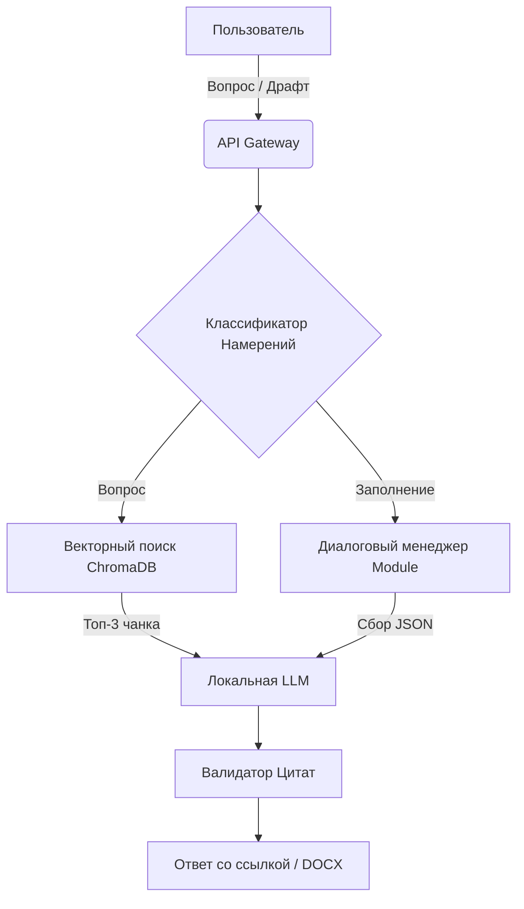
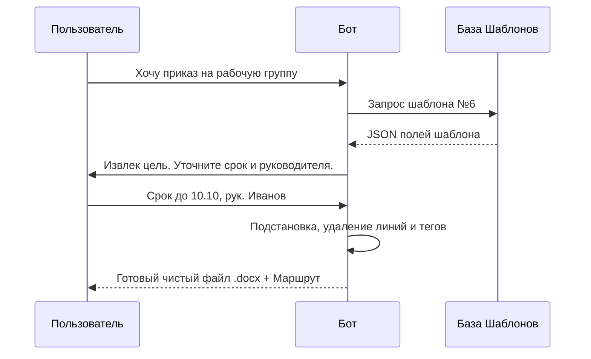

# Схемы для презентации

## 1. Общая архитектура RAG

```mermaid
graph TD
    A[Пользователь] -->|Вопрос / Драфт| B(API Gateway)
    B --> C{Классификатор Намерений}
    C -->|Вопрос| D[Векторный поиск ChromaDB]
    C -->|Заполнение| E[Диалоговый менеджер Module]
    D -->|Топ-3 чанка| F[Локальная LLM]
    E -->|Сбор JSON| F
    F --> G[Валидатор Цитат]
    G --> H[Ответ со ссылкой / DOCX]
```

## 2. Жизненный цикл заполнения модуля

```mermaid
sequenceDiagram
    participant U as Пользователь
    participant B as Бот
    participant DB as База Шаблонов
    U->>B: Хочу приказ на рабочую группу
    B->>DB: Запрос шаблона №6
    DB-->>B: JSON полей шаблона
    B->>U: Извлек цель. Уточните срок и руководителя.
    U->>B: Срок до 10.10, рук. Иванов
    B->>B: Подстановка, удаление линий и тегов
    B-->>U: Готовый чистый файл .docx + Маршрут
```